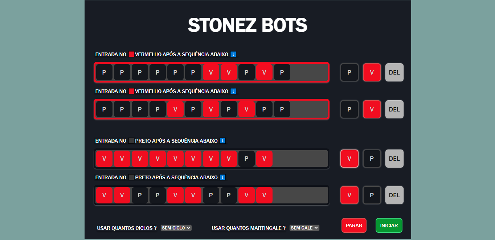
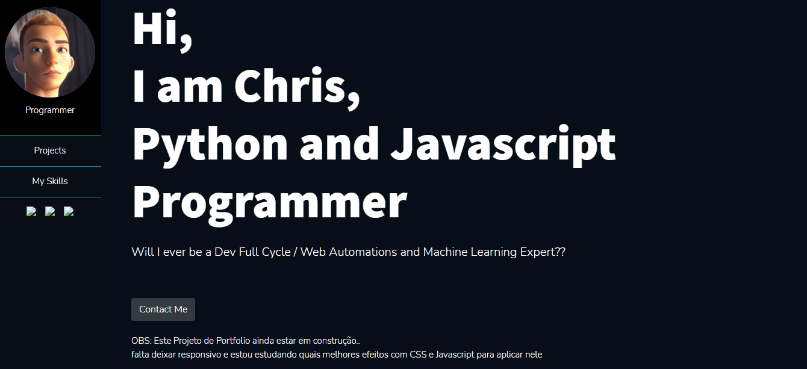
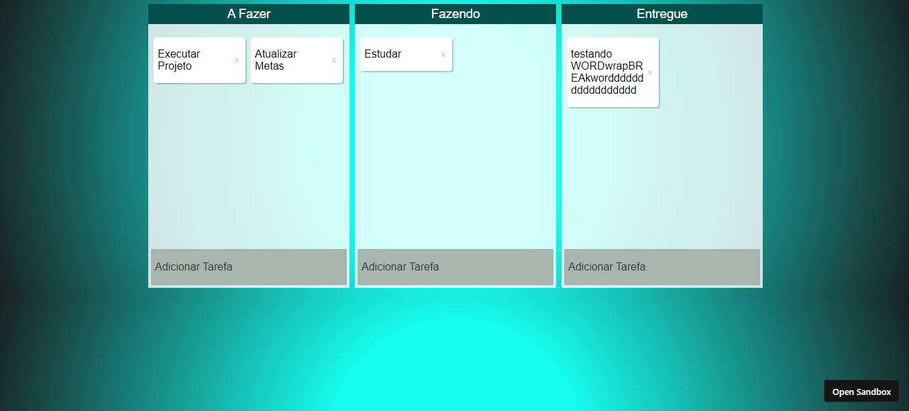
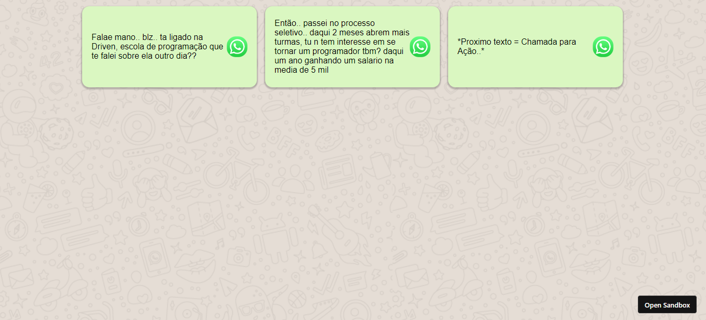
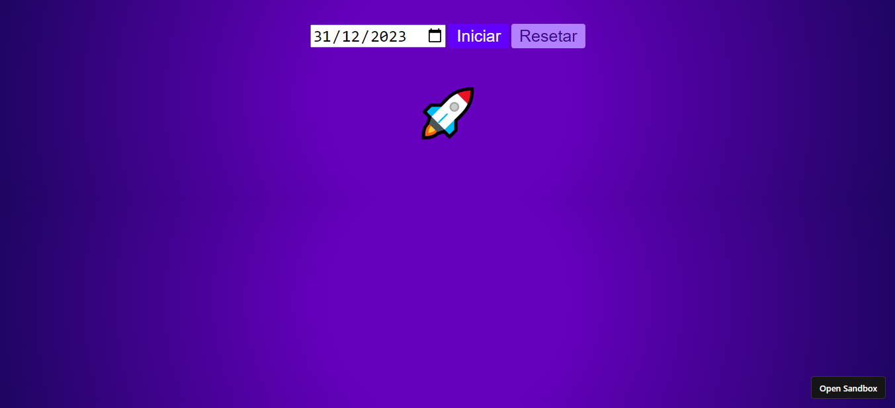
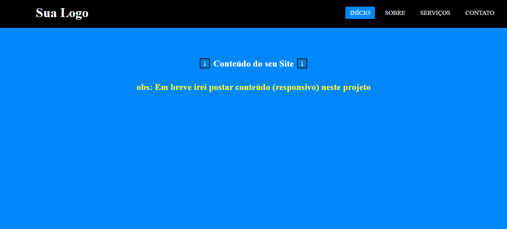

## Olá! Eu sou Crisvagner, freelancer👨‍💻 programador Python e Javascript 💻 

 

## > Tenho conhecimentos em Git, RegEx, CSS, HTML, Electron, Puppeteer, Selenium, interpretação de documentação de APIs, Libs e Frameworks 📚

 

## > Noções de Express, Deploy, Empacotamento e Obfuscação de Código, I read simple text in English.

<!--  
 

## ▶️ Dê uma olhada em meu Portfólio   -->

 
 

  

 

## Tecnologias que eu uso em meus projetos

        

 
 

## Veja meus Projetos Pessoais 👇

 

    
    

 

## Outros Projetos 👇

 

    
    
    
    

 

## Minhas Redes Sociais

    
    
    
    
    

